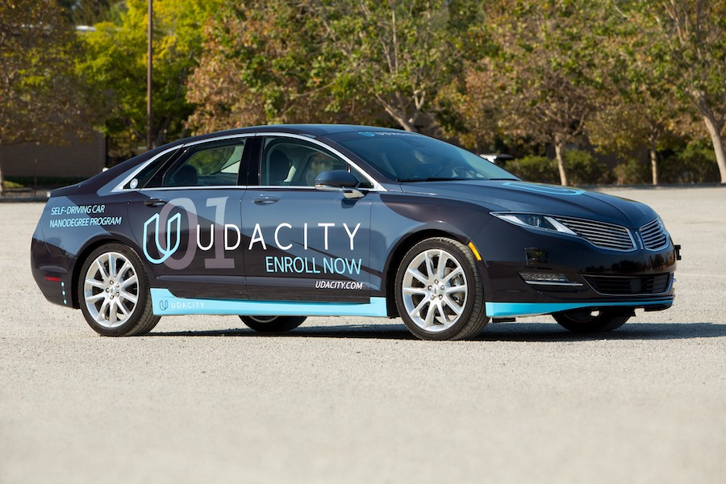
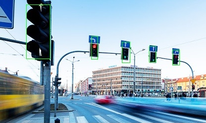

# Project description
This is runtime version of keras-based traffic light detector. As simple as possible.

The main purpose of this project is to address Red Litht Detection sub-project of [the capstone project](https://github.com/udacity/CarND-Capstone) of [Self-Driving Car Engineer Nanodegree](https://www.udacity.com/course/self-driving-car-engineer-nanodegree--nd013) by [Udacity](https://www.udacity.com/). The intent of this code is to be reaty to be used on CARLA autonomous car:

*Sample result*:

# Model
The used model is Tiny [YOLO](https://pjreddie.com/darknet/yolo/) v3  
(described in paper "[YOLOv3: An Incremental Improvement](https://arxiv.org/pdf/1804.02767.pdf)")

# Refrences
The code is basing on github repository:   [qqwweee/keras-yolo3](https://github.com/qqwweee/keras-yolo3)